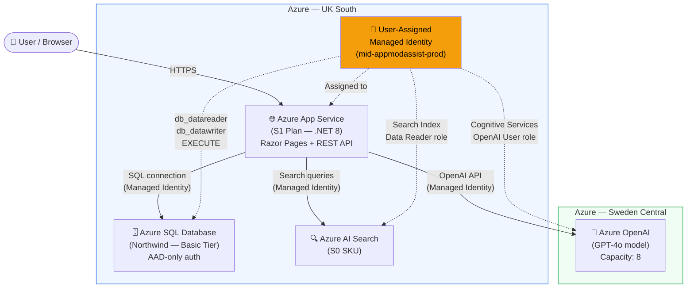

# Architecture: Expense Management System on Azure

## Overview

This repository deploys a modern expense management application on Azure using Infrastructure-as-Code (Bicep), ASP.NET Core .NET 8, and Azure services.

## Azure Services Architecture



## Component Descriptions

| Service | SKU | Region | Purpose |
|---------|-----|--------|---------|
| **App Service Plan** | S1 Standard | UK South | Hosts the .NET 8 web application (no cold starts) |
| **App Service** | — | UK South | Runs Razor Pages UI + REST API + Swagger |
| **Azure SQL** | Basic | UK South | Stores expenses, users, categories, statuses |
| **Azure OpenAI** | S0 / Standard | **Sweden Central** | GPT-4o model for AI assistant with function calling |
| **Azure AI Search** | S0 | UK South | Search index for RAG-based chat context |
| **Managed Identity** | User-assigned | UK South | Passwordless auth between all services |

## Security

- **No passwords or keys** stored anywhere — all connections use Managed Identity
- **AAD-only authentication** on SQL Server (MCAPS governance compliant)
- Managed Identity has **minimum required permissions** on each service
- App Service configured with **HTTPS-only**

## Deployment Flows

### Without GenAI (`bash deploy.sh`)
```
User → App Service → Azure SQL
```

### With GenAI (`bash deploy-with-chat.sh`)
```
User → App Service → Azure SQL
User → App Service → Azure OpenAI (function calling)
User → App Service → Azure AI Search
```

## Data Flow

1. **Browser** → makes HTTPS request to App Service
2. **Razor Pages** render the UI using data from API controllers
3. **API Controllers** call `IExpenseService` which executes **stored procedures** via Managed Identity connection to Azure SQL
4. **Chat API** calls `IChatService` which uses Azure OpenAI with **function calling** to interact with the expense data
5. **Managed Identity** authenticates all Azure service-to-service calls (no secrets needed)
